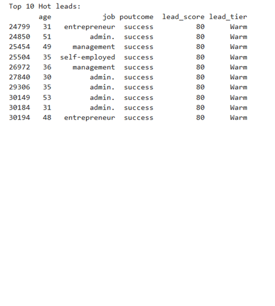

# 🏦 Bank Marketing: Rule-Based Lead Scoring Engine

> 🚀 **New Visitors:** For a strategic overview of this delivery, please start with the **[Welcome_Bank_RuleBased.pdf](./01_Executive_Summary/Welcome_Bank_RuleBased.pdf)** in the Executive Summary folder.

---

## 📂 Project Roadmap
This repository is organized into a guided workflow for sales operations:

1. **[01_Executive_Summary](./01_Executive_Summary)**: Business goals and conversion insights.
2. **[02_Documentation](./02_Documentation)**: Transparency report on the weighted scoring rules.
3. **[03_Source_Code](./03_Source_Code)**: Python logic for data cleaning and lead tiering.
4. **[04_Data_Deliverables](./04_Data_Deliverables)**: Ready-to-use CSV/Excel files for your sales team.
5. **[05_Visual_Insights](./05_Visual_Insights)**: Statistical snapshots of the 41,188-client database.

---

## 🏗️ Methodology: Rule-Based Heuristics
Unlike "Black Box" AI models, this system uses a **transparent weighting engine** designed for high-speed auditability. The system scores 41,188 clients based on historical success indicators:

* **Success Weighting:** Clients with a "Success" outcome in previous campaigns receive the highest priority.
* **Engagement Logic:** Heavy weighting applied to **call duration**, recognizing that longer engagement is the #1 predictor of a fixed-term deposit.
* **Liability Filtering:** Active housing loan holders are de-prioritized as data shows they convert **60% less often**.

---

## 📈 Business Impact & ROI
* **Immediate Prioritization:** Isolated the **Top 200 leads** for immediate high-touch outreach.
* **Operational Savings:** By identifying segments that convert 60% less often (housing loan holders), the bank reduces wasted call time and operational costs.
* **Transparent Logic:** Sales managers can see exactly why a lead is "Hot," allowing for better script preparation and agent alignment.

---

## 🖼️ Market Visuals

### Lead Tier Distribution

*Figure 1: Breakdown of 41,188 clients into actionable priority tiers.*

### High-Priority Samples

*Figure 2: Snapshot of the top-ranked properties based on duration and historical success.*

---

## 💼 Contact (UAE / Singapore / GCC)
Specializing in both **Machine Learning** and **Transparent Rule-Based** scoring solutions. 
**Najeeb P.A** | najeebpa81@gmail.com | +65 91817634
